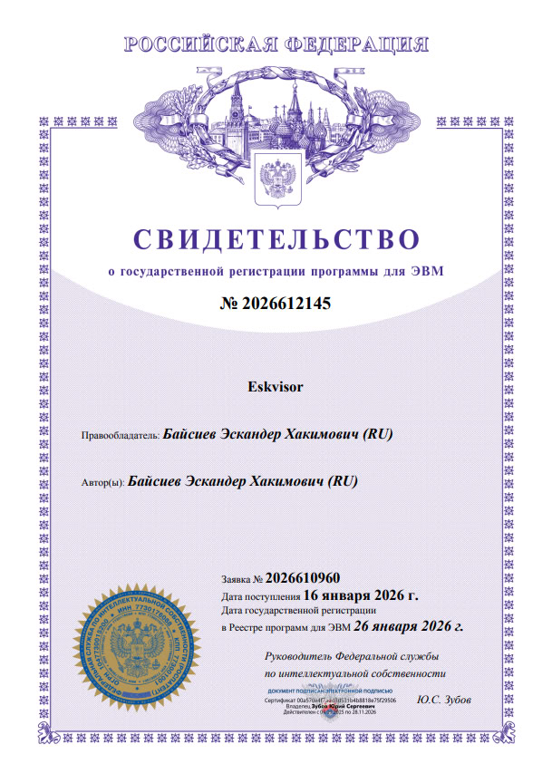

<meta name="description" content="Eskvisor - open source KVM virtualization management platform with cgroups v2 resource pools, real-time WebSocket task notifications, and automated agent deployment. Lightweight Proxmox alternative.">
<meta name="keywords" content="KVM, libvirt, virtualization, cgroups, resource management, Proxmox alternative, open source, Python, FastAPI, Redis, homelab, self-hosted">

# Eskvisor - проект управления виртуализацией


**Eskvisor** — система управления виртуализацией. Полное название является производным от **"Eska"** (идентификатор разработчика) и **"hypervisor"**, что отражает основную цель проекта — предоставление детального контроля над виртуальной инфраструктурой.

### Eskvisor — облегченная платформа управления KVM с встроенным управлением ресурсами cgroups v2 и уведомлениями о задачах в реальном времени.
## ✨ Почему Eskvisor?

| Функция | Eskvisor | Proxmox | oVirt |
|---------|----------|---------|-------|
| Пулы ресурсов cgroups v2 | ✅ | ❌ | ❌ |
| Задачи в реальном времени через WebSocket | ✅ | ❌ | ❌ |
| Автоматическое развёртывание агентов | ✅ | ❌ | ✅ |
| Цепочки снимков (снапшотов) | ✅ | ✅ | ✅ |


## Структура проекта
```yaml
├── agent # Директория агента для управления гипервизором на стороне хоста подключенного к кластеру
│   ├───client # Директория клиента для работы с гипервизором, моделями, тестами и т.д
│   │   ├───hypervisor # Директория с основной кодовой базой гипервизора
│   │   │   └───libvirt # Директория с менеджерами для взаимодействия с libvirt
│   │   │       ├───managers # Директория с менеджерами для работы с библиотеками виртуализации
│   │   │       │   ├───balansir.py # Виртуальный менеджер ресурс пулов для контроля CPU и RAM лимитов
│   │   │       │   ├───network.py # Файл-менеджер для работы с виртуальными сетями
│   │   │       │   ├───snapshot.py # Файл-менеджер для работы со снапшотами
│   │   │       │   ├───storage.py # Файл-менеджер для работы с виртуальными дисками
│   │   │       │   ├───virsh.py # Файл-менеджер для установки соединения с гостевой OS виртуальной машины
│   │   │       │   ├───vm.py # айл-менеджер для работы с виртуальными машинами
│   │   │       │   └───vm_stats.py # Файл-менеджер для live чтения состоянии ВМ
│   │   │       ├───models # Директория с моделями объектов для работы с виртуализацией
│   │   │       │   ├───vm_stats # Директория моделей для работы с получением статистики ВМ
│   │   │       │   │   └───stats.py # Файл с моделями статистики ВМ
│   │   │       │   ├───volume # Директория моделей для работы с хранилищами
│   │   │       │   │   ├───balansir.py # Файл с моделями менеджера ресурс пулов <<Балансиръ>>
│   │   │       │   │   ├───disk.py # Файл с моделями виртуальных дисков
│   │   │       │   │   ├───grou.py # Файл с моделями Group Volume
│   │   │       │   │   ├───logic.py # Файл с моделями Logic Volume
│   │   │       │   │   └───physical.py # Файл с моделями Physical Volume
│   │   │       │   ├───__init__.py # Файл превращает обычную папку в пакет Python
│   │   │       │   ├───controller.py # Файл с моделями контроллеров
│   │   │       │   ├───enum.py # Файл с основными enum параметрами
│   │   │       │   ├───general.py # Файл с общими моделями
│   │   │       │   ├───msg.py # Файл с моделями собщений(для ответов менеджеров)
│   │   │       │   ├───network.py # Файл с моделями виртуальных сетей
│   │   │       │   ├───node.py # Файл с моделями хостов
│   │   │       │   ├───snapshots.py # Файл с моделями снапшотов
│   │   │       │   └───vm.py # Файл с моделями виртуальных машин
│   │   │       ├───client.py # Файл-клиент с основными настройками для работы с python библиотекой libvirt
│   │   │       └───config.py # Файл с дополнительными конфигами
│   │   ├───lvm # Директория с менеджерами для управления Physical Volume, Group Volume, Logic Volume
│   │   │   ├───logical.py # Файл-менеджер для управления Logic Volume
│   │   │   ├───physical.py # Файл-менеджер для управления Physical Volume
│   │   │   ├───group.py # Файл-менеджер для управления Group Volume
│   │   │   └───README.txt # Файл с коротким описанием работы Physical Volume, Group Volume, Logic Volume
│   │   ├───models # Директория с общими моделями для всего проекта
│   │   ├───pycgroup # Директория для работы с системой контроля ресурсов cgroup v2
│   │   │   ├───ctl #  Директория для управления контроллеров cpu, io, memory, pid
│   │   │   │   ├───cpu_ctl.py #  Файл-менеджер для управления контроллера cpu
│   │   │   │   ├───io_ctl.py #  Файл-менеджер для управления контроллера io
│   │   │   │   ├───memoryo_ctl.py #  Файл-менеджер для управления контроллера memory
│   │   │   │   └───memoryo_ctl.py #  Файл-менеджер для управления контроллера pid
│   │   │   ├───state #  Директория с сервисом cgroup-eskvisor для восстановления и сохранения состояния ресурс пулов в системе cgroup v2
│   │   │   │   ├───cgroup-state.service #  Файл с сервисом cgroup-state.service для systemd службы
│   │   │   │   ├───cgroup-state-timer.timer #  Файл с сервисом cgroup-state-timer.timer для systemd службы с сохранием ресурс пулов по таймеру
│   │   │   │   ├───migrate.sh #  Скрипт для миграции ресурс пулов cgroup v2 на целевой хост
│   │   │   │   ├───README.txt #  Примеры запуска скрипта migrate.sh
│   │   │   │   ├───restore.sh #  Скрипт для восстановления ресурс пулов в системе cgroup v2
│   │   │   │   ├───save.sh #  Скрипт для сохранения ресурс пулов из системы cgroup v2
│   │   │   │   ├───setup.sh #  Скрипт для установки сервиса cgroup-eskvisor
│   │   │   │   └───verify.sh #  Скрипт для проверки состояния служб и директории сервиса cgroup-eskvisor
│   │   │   ├───cgroup_cli.py # Файл менеджер для работы с консолью для pycgroup
│   │   │   ├───pycgroup.py # Файл менеджер для прямого взаимодействия с системой pycgroup
│   │   │   ├───pycgroup_logger.py  # Файл с основными настройками для логгирования pycgroup
│   │   │   └───README.txt  # Файл с визуальным описанием работы системы cgroup v2 и заметками
│   │   ├───stg # Директория с менеджерами управления внешними хранилищами
│   │   │   ├───controller.py # Файл-менеджер для более широкого спектра работы с NFS хранилищами
│   │   │   └───nfs.py # Файл-менеджер для работы с NFS хранилищами
│   │   ├───task_manager # Директория с менеджером очередей с использованием Redis
│   │   │   ├───ctl_queue.py # Файл-менеджер для управления очередями непосредственно в Redis
│   │   │   ├───dispatcher.py # Диспетчер задач для управления воркерами и распределения задач
│   │   │   ├───models.py # Файл с моделями менеджера очередей
│   │   │   └───worker.py # Файл-менеджер с воркерми(которые берут задачи из пула и выполняют, если там есть задачи)
│   │   │   └───ws_notification.py # Файл обработчик WebSocket уведомлений
│   │   ├───tests # Директория с основной кодовой базой автотестов
│   │   │   ├───networks # Директория с автотестами по виртуальным сетям
│   │   │   ├───resource_containment # Директория с нагрузочными автотестами
│   │   │   ├───resource_pool # Директория с автотестами по ресурс пулам
│   │   │   ├───snapshots # Директория с автотестами по снапшотам
│   │   │   ├───storage # Директория с автотестами по виртуальным дискам
│   │   │   ├───system # Директория с автотестами по системным функциям агента
│   │   │   ├───virtual_machine # Директория с автотестами по виртуальным дискам
│   │   │   ├───__init__.py # Файл превращает обычную папку в пакет Python
│   │   │   └───conftest.py # Файл с фикстурами автотестов
│   │   ├───__init__.py # Файл превращает обычную папку в пакет Python
│   │   ├───cli.py # Файл для работы с командной строкой
│   │   ├───constants.py # Файл с основными константами проекта
│   │   ├───logger_config.py # Файл с основными настройками для логгирования
│   │   ├───main.py # Файл с backend частью агента для получения статистики, получения и выполнения задач, отправки уведомлении по ходу выполнения задач
│   │   └───tools.py # Дополнительные инструменты проекта
│   ├───.env # Файл с конфигурацией проекта
│   ├───install_agent.sh # Файл установщик агента
│   ├───nginx.conf # NGINX конфигурация агента
│   └───requirements.txt # Файл с необходимыми библиотеками для работы агента
├───backend # Деректория с backend'ом проекта eskvisor
│   ├───api # Директория со статическими файлами лендинга проекта
│   │   ├───routers # Директория с api методами
│   │   │   ├───system.py # API для работы с системными вызовами
│   │   │   ├───users.py # API для работы с пользователями
│   │   │   └───vm.py # API для работы с виртуальными машинами
│   │   └───dependencies.py # Зависимости для API
│   ├───src # Директория со статическими файлами лендинга проекта
│   │   ├───db # Директория для работы с базами данных
│   │   │   └───users.py # Файл-менеджер для управления базой данных пользователей
│   │   ├───models # Директория с моделями проекта
│   │   │   ├───agent.py # Файл с моделями агента
│   │   │   ├───error.py # Файл с моделями и сообещниями ошибок
│   │   │   ├───general.py # Файл с общими моделями
│   │   │   └───user.py # Файл с моделями пользователей
│   │   ├───rbac # Директория с моделями ролевой модели
│   │   │   ├───example_usage.py # Файл с примерами использования
│   │   │   ├───permissions.py # Файл с моделями доступов
│   │   │   └───roles_and_users.py # Файл с моделями ролей и пользователей
│   │   ├───services # Директория с основными сервисами проекта
│   │   │   ├───hash.py # Файл-менеджер для работы с хэшем
│   │   │   ├───jwt.py # Файл-менеджер для работы с JWT токенами
│   │   │   ├───redis_srv.py # Файл-менеджер для работы с Redis
│   │   │   └───ssh_keygen.py # Файл-менеджер для генерации SSH ключей
│   │   ├───tools # Директория с дополнительными инструментами
│   │   │   └───cli.py # Файл для работы с командной строкой
│   │   ├───agent_installer.py # Файл-менеджер с методами для установками агентами на хост
│   │   ├───constants.py # Файл с константами
│   │   └───logger_config.py # Файл с основными настройками для логгирования
│   ├───.env # Файл с конфигурацией проекта
│   ├───main.py # API методы + точка запуска backend'а
│   └───requirements.txt # Зависимости backend'а
├───docs # Директория с основными документами
├───landing # Деректория лендинга проекта
│   ├───app # Директория со статическими файлами лендинга проекта
│   │   └───templates # Директория с шаблонами html
│   │       └───landing.html # Главная и единственная страница лендинга
│   ├───certificate.crt # Сертификат лендинга с доменом eskvisor.ru
│   ├───certificate.key # Ключ сертификата
│   ├───commands.txt # Команды для развертывания лендинга в облаке
│   ├───main.py # Backend часть лендинга
│   ├───nginx.conf # NGINX конфигурация лендинга
│   └───requirements.txt # Python зависимости лендинга
├───.flake8 # Файл с конфигурацией анализатора кода flake8
├───.gitconfig # Файл с конфигурацией Git
├───.gitignore # Файл для игнорирования мусора при работа с Git
├───build_test_alpine.txt # Инструкция по сборке всех зависимостей для работы агента на тестовом alpine linux
├───commands.txt # Файл с командами для стартовой настройки проекта
├───LICENSE.md # Файл-лицензия на проект
├───logo.jpg # Логотип проекта
├───py_linter.txt # Файл с инструкцией запуска линтеров
├───pytest.ini # Файл для доп настройки pytest'а
└───README.md # Файл для описания структуры проекта, инструкции по запуску автотестов, использованию агента и т.д
```

#### Backend единый - WebSocket Handler часть Backend'а, а не отдельный компонент

#### Воркеры сами забирают задачи из очереди (pull-модель)

#### Двойной механизм получения результатов: push через WebSocket + pull через REST API

## Государственная регистрация №2026612145
